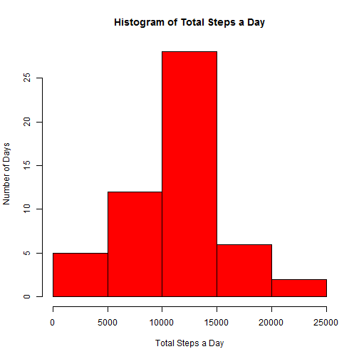
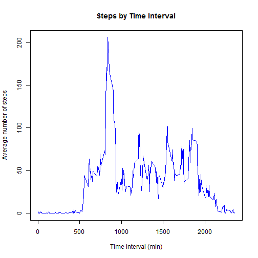
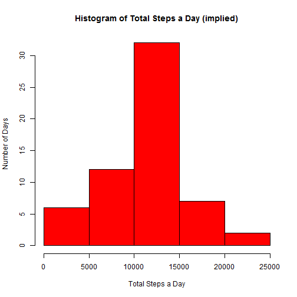
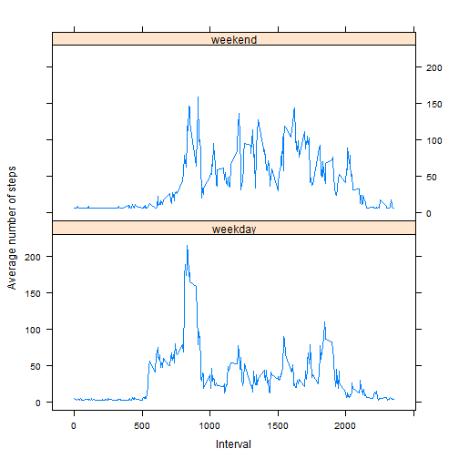

Peer Assesment 1
=====================================================


```r
unzip("repdata-data-activity.zip") # unzip the file
classes <- c("numeric", "Date", "numeric") # set classes
activity <- read.csv("activity.csv", header = TRUE, colClasses = classes, na.strings="NA") # read file
```

** Calculating the mean and median of total steps per day**

```r
activityrmna <- activity[complete.cases(activity), ] # removing NAs
sum <- aggregate(activityrmna$steps, by = list(Date=activityrmna$date), FUN = sum)
hist(sum$x, main="Histogram of Total Steps a Day", xlab="Total Steps a Day", ylab="Number of Days", col="red")
```

 
- The mean number of total steps per day is 1.0766 &times; 10<sup>4</sup> steps and the median is 1.0765 &times; 10<sup>4</sup> steps.

** The following plot shows the daily activity pattern**

```r
## Plot average number of steps by time interval
# average is the name of the data table that contains the average number of steps taken by time interval
average <- aggregate(activityrmna$steps, by = list(interval = activityrmna$interval), FUN = mean)
plot(average$interval, average$x, type = "l", col="blue", main = "Steps by Time Interval", xlab="Time interval (min)", ylab="Average number of steps")
```

 

```r
# Time interval that has the maximum of the average number of steps
maximum <- average[average$x == max(average$x),]
```

- The time interval that has the max number of steps is 835

** Imputing missing values**
- The total number of missing values in the dataset is 2304

The missing values have been filled in the dataset with the following code.
Missing value is the average of the step count for the day of all intervals

```r
# Calculate average steps in a day
avgDate <- aggregate(activityrmna$steps, by = list(date=activityrmna$date), FUN = mean) # date frame with average steps per date
mergedData <- merge(activity, avgDate, by.x="date", by.y="date", all.x=TRUE) # merge original data with NAs with implied data
mergedData$steps[is.na(mergedData$steps)] <- mergedData$x # replace NA with implied data
```

```
## Warning: number of items to replace is not a multiple of replacement
## length
```

```r
mergedData$x <- NULL # remove the implied column to clean up
mergedDatarmna <- mergedData[complete.cases(mergedData), ] # new data frame with NAs removed

impliedSum <- aggregate(mergedDatarmna$steps, by = list(Date=mergedDatarmna$date), FUN = sum)
hist(impliedSum$x, main="Histogram of Total Steps a Day (implied)", xlab="Total Steps a Day", ylab = "Number of Days", col="red")
```

 
- With the implied values filled in, the mean number of steps is 1.0745 &times; 10<sup>4</sup> steps and the median is 1.1015 &times; 10<sup>4</sup> steps.

- The values are different from the first part. The implied mean is LOWER by -21.5955 and the implied median is HIGHER by 250.

- By imputing the missing data, the total number of steps is higher by 6.3323 &times; 10<sup>4</sup> steps.

** Differences in activity patterns between weekdays and weekends**

```r
mergedDatarmna$day <- weekdays(mergedDatarmna$date) # adding a column identifying days of the week
## Separating out weekend days by spliting the data frame
for (i in 1:nrow(mergedDatarmna)) {
  if(mergedDatarmna$day[i] == "Saturday" | mergedDatarmna$day[i] == "Sunday") {mergedDatarmna$day[i] = "weekend"} else {mergedDatarmna$day[i] = "weekday"}
}

weekend <- mergedDatarmna[(mergedDatarmna$day=="weekend"), ] # Creating weekend data frame
weekday <- mergedDatarmna[(mergedDatarmna$day=="weekday"), ] # Creating weekday data frame

## Averaging by 5 min interval
avgweekend <- aggregate(weekend$step, by = list(interval=weekend$interval), FUN = mean) # calculating avg steps per interval for weekend data frame
```

```
## Warning: Name partially matched in data frame
```

```r
avgweekday <- aggregate(weekday$step, by = list(interval=weekday$interval), FUN = mean) # calculating avg steps per interval for weekday data frame
```

```
## Warning: Name partially matched in data frame
```

```r
avgweekend$day = "weekend" #adding back the day indentifier
avgweekday$day = "weekday" #adding back the day identifier
total <- merge(avgweekday, avgweekend, all.x=TRUE, all.y=TRUE) #merging the weekend and weekday datasets 
total <- transform(total, day = factor(day)) # converting day to factor
library(lattice)
xyplot(x ~ interval | day, data = total, layout=c(1,2), type="l", xlab="Interval", ylab="Average number of steps")
```

 
- The plots show that on an average weekday, the subjects walks a lot in the morning, followed by a period of low activity (maybe sitting in the office) and then walks in the evening. During an average weekend, the walking activity is more evenly spread out from morning to evening.
